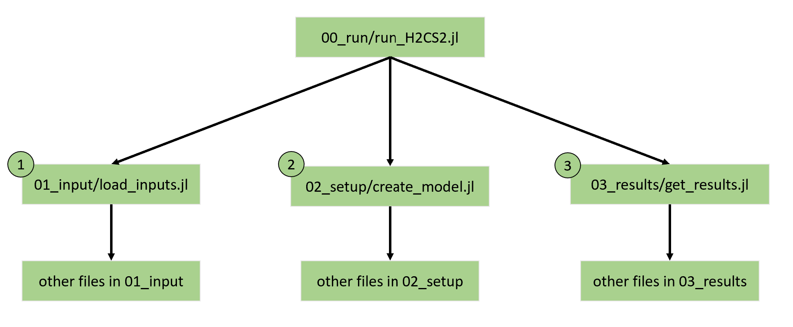

File Overview
========

H2CS2 optimizes hydrogen production subject to a fixed demand for hydrogen. It is flexible spatially and temporally, being able to simulate multiple regions, multiple years, and multiple sub-annual time periods.

In the text below, we provide a brief description of the model file structure. More details on the model
formulation can be found in the relevant tabs of the model documentation.

## Inputs
The model inputs are in the form of an Excel Workbook. More information on the model inputs can be found in the **Inputs** section of the documentation.

## Source Code
The model source code is located in the **src** folder. This folder contains the following subfolders:

1. **00_run** - contains the function for running the H2CS2 model. 
2. **01_input** - contains all code for loading inputs from the inputs spreadsheets. The main file is 'load_inputs.jl'
3. **02_setup** - contains all code for setting up the model. The main file is 'create_model.jl'
4. **03._results** - contains all code for extracting the model results and formatting the outputs. The main file is 'get_results.jl'.

Each folder contains one main file which executes calls on all other files and functions to perform the executed tasts. The main files, and the order in which they are called, are shown in the diagram below.


*Figure. File structure of the H2CS2 model*


## Outputs
The model output is a Excel Workbook. More information on the model output structure can be found the the **Outputs** section of the documentation.

## Documentation

Text and figures for the model documentation is located in the *docs* folder. All documentation is written in the markdowns files contained in this folder, or in docstrings directly in the code files themselves. In order to recreate the HTML documentation, run the file **make.jl**. This can be done using the following commands:

First, navigate to the *docs* folder.
```julia
cd H2CS2/docs
```

Then, open a Julia command prompt

```julia
julia --project
```

Finally, run the **make.jl** file:
```julia
julia> include("make.jl")
```

## Miscellaneous

The **Project.toml** file stores information on the packages required for the model. This enables seamless installation of all required packages when the model is first run.

The **Manifest.toml** file, if present, stores specific information about how and where packages are installed on your computer. This is user specific and should not be pushed to the GitHub repository.